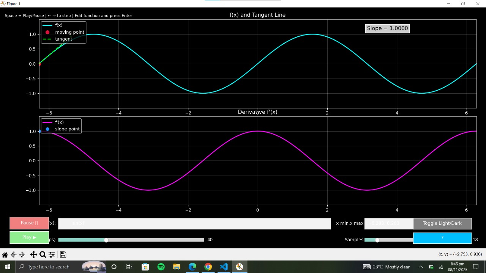
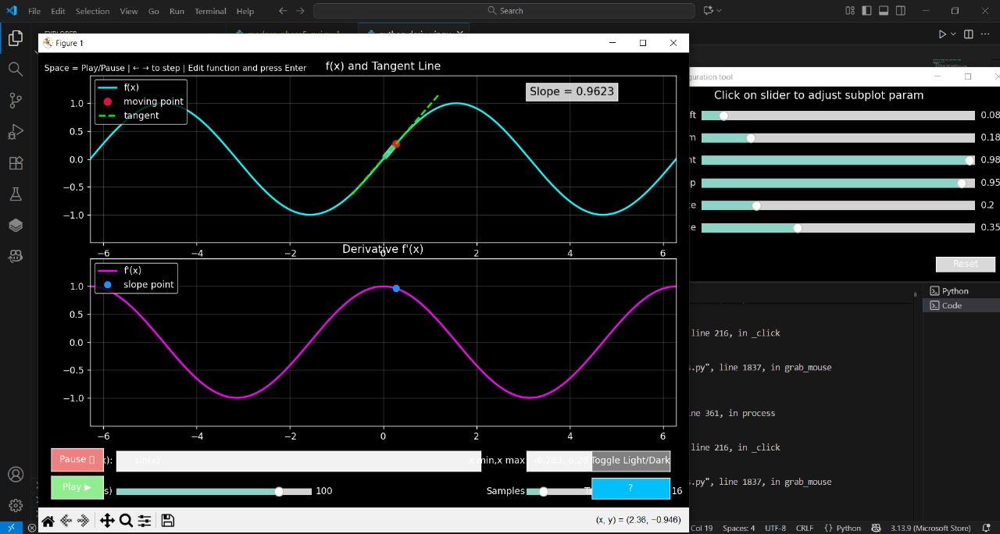
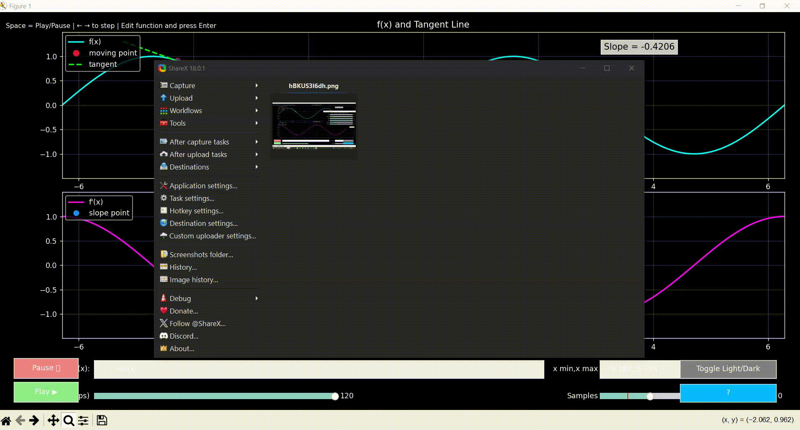

<div align="center">

# Interactive Derivative Visualizer


<br>

<pre>
██████╗ ███████╗██████╗ ██╗██╗   ██╗
██╔══██╗██╔════╝██╔══██╗██║██║   ██║
██║  ██║█████╗  ██████╔╝██║██║   ██║
██║  ██║██╔══╝  ██╔══██╗██║╚██╗ ██╔╝
██████╔╝███████╗██║  ██║██║ ╚████╔╝
╚═════╝ ╚══════╝╚═╝  ╚═╝╚═╝  ╚═══╝
</pre>

### Visualizing Calculus Through Motion, Geometry, and Intuition

**See a function, its tangent line, and its derivative animate together in real time.**

</div>

---

# Demo

### Interactive Visualization

<p align="center">
  
</p>

### Real-Time Tangent Tracking

<p align="center">
  
</p>

### Animation Preview

<p align="center">
  
</p>

---

# The Problem

Most students learn derivatives through memorization:

```text
d/dx(x²) = 2x
d/dx(sin x) = cos(x)
d/dx(eˣ) = eˣ
```

But these formulas often hide the deeper intuition behind differentiation.

A derivative is more than a rule.

It represents:

- Instantaneous rate of change
- Slope of a curve
- Velocity of a function
- Local behavior of a mathematical system

Traditional textbooks usually rely on static diagrams, making it difficult to connect these concepts visually.

---

# The Solution

**Interactive Derivative Visualizer** transforms differentiation into a dynamic visual experience.

Instead of memorizing rules, users can watch:

- A point moving along a function
- A tangent line updating continuously
- The derivative graph responding in real time
- Slope magnitude and direction represented through color

The result is a much stronger geometric understanding of calculus.

---

# Features

| Feature | Description |
|----------|-------------|
| Real-Time Synchronization | Function and derivative animate simultaneously |
| Dynamic Tangent Line | Visualizes instantaneous slope |
| Slope-Based Color Mapping | Color changes according to derivative value |
| Custom Function Input | Enter your own mathematical expressions |
| Adjustable Domain | Modify graph ranges instantly |
| Animation Controls | Play, pause, and step through frames |
| Trail Effects | Leave historical points behind the moving tracker |
| Dark / Light Themes | Toggle between presentation and study modes |
| Numerical Differentiation | Supports arbitrary valid functions |
| Interactive Widgets | Built entirely using Matplotlib widgets |

---

# Architecture

```text
╔══════════════════════════════════════════════════════════════╗
║                    VISUALIZER PIPELINE                      ║
╠══════════════════════════════════════════════════════════════╣
║                                                              ║
║  User Function Input                                         ║
║          │                                                   ║
║          ▼                                                   ║
║  Safe Expression Parser                                      ║
║          │                                                   ║
║          ▼                                                   ║
║  NumPy Evaluation Engine                                     ║
║          │                                                   ║
║          ├────────► Function f(x)                            ║
║          │                                                   ║
║          └────────► Derivative f'(x)                         ║
║                        using np.gradient()                  ║
║                                │                             ║
║                                ▼                             ║
║                  Matplotlib Animation Loop                  ║
║                                │                             ║
║                                ▼                             ║
║                 Interactive Visualization                   ║
║                                                              ║
╚══════════════════════════════════════════════════════════════╝
```

---

# How It Works

The user enters a mathematical expression:

```python
sin(x) * exp(-0.2*x)
```

The program:

1. Parses the expression safely
2. Generates sample points using NumPy
3. Computes the derivative numerically
4. Animates both graphs simultaneously
5. Updates tangent lines and tracking points every frame

This creates a live visual relationship between:

```text
Function → Slope → Derivative
```

---

# Mathematical Model

The derivative is approximated numerically using:

```python
dy_dx = np.gradient(y_values, dx)
```

Conceptually:

```text
f'(x) ≈ Δy / Δx
```

This allows the visualizer to work with a wide variety of functions without requiring symbolic differentiation.

---

# Dynamic Slope Color Mapping

One of the most distinctive features of the visualizer is its slope-driven color system.

The instantaneous slope is transformed using:

```text
t = tanh(f'(x))
```

This smoothly compresses large positive and negative values into:

```text
[-1, 1]
```

The value is then projected into RGB space.

| Slope | Color |
|---------|---------|
| Large Negative | Blue |
| Zero | Purple |
| Large Positive | Red |

### Intuition

```text
Negative Slope  → Blue
Zero Slope      → Purple
Positive Slope  → Red
```

This allows users to instantly recognize:

- Increasing intervals
- Decreasing intervals
- Local maxima
- Local minima
- Stationary points

without looking at numerical values.

---

# Interactive Controls

| Control | Function |
|----------|----------|
| Function Input | Enter custom functions |
| Domain Input | Set x-axis range |
| Speed Slider | Control animation speed |
| Samples Slider | Change graph resolution |
| Trail Slider | Adjust ghost-point history |
| Play / Pause | Start or stop animation |
| Theme Toggle | Switch Dark/Light mode |
| Arrow Keys | Frame-by-frame navigation |

---

# Supported Functions

### Trigonometric

```python
sin(x)
cos(x)
tan(x)
```

### Inverse Trigonometric

```python
arcsin(x)
arccos(x)
arctan(x)
```

### Hyperbolic

```python
sinh(x)
cosh(x)
tanh(x)
```

### Algebraic

```python
x**2
sqrt(x)
abs(x)
```

### Exponential & Logarithmic

```python
exp(x)
log(x)
```

### Constants

```python
pi
e
```

---

# Example Inputs

```python
sin(x)
cos(x)
x**3 - 3*x
sin(x) * exp(-0.2*x)
sqrt(abs(x))
log(x + 10)
```

---

# Installation

## Clone the Repository

```bash
git clone https://github.com/Shahrukh-aidev/interactive-derivative-visualizer.git

cd interactive-derivative-visualizer
```

## Install Dependencies

```bash
pip install numpy matplotlib
```

## Run the Application

```bash
python python_deriv_viz.py
```

---

# Project Structure

```text
interactive-derivative-visualizer
│
├── python_deriv_viz.py
├── pic1.jpg
├── pic2.jpg
├── W8me6GPdMF.mp4
├── LICENSE
└── README.md
```

---

# Educational Applications

This project is useful for:

- Calculus Students
- Mathematics Teachers
- STEM Demonstrations
- Classroom Presentations
- Self-Learning
- Interactive Education

It bridges the gap between symbolic mathematics and geometric intuition.

---

# Technologies Used

| Technology | Purpose |
|------------|----------|
| Python | Core application |
| NumPy | Mathematical computation |
| Matplotlib | Plotting and animation |
| Matplotlib Widgets | Interactive controls |

---

# Future Improvements

- Symbolic differentiation with SymPy
- Second derivative visualization
- Integral visualization mode
- Multi-function comparison
- 3D derivative surfaces
- GIF/Video export
- Built-in function presets
- Derivative value display

---

# License

Licensed under the Apache License 2.0.

This project is free to use, modify, and distribute under the terms of the Apache License.

---

<div align="center">

### Built to make calculus intuitive.

⭐ If you found this project useful, consider starring the repository.

</div>
